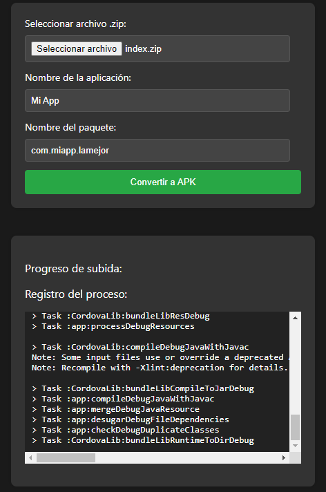

 Esta es una plataforma de prueba de aplicaciones web basada en Apache Cordova. Puede convertir aplicaciones web creadas en HTML en archivos APK mediante la CLI de Cordova. Permite que los desarrolladores carguen su aplicación web en formato zip y proporciona actualizaciones de progreso de compilación en tiempo real a través de una conexión socket.io.



## Implementación

Esta aplicación está acoplada a Docker. Puedes implementar la aplicación siguiendo los siguientes pasos:

1. Aseg�rate de tener instalado Docker en tu máquina. Si no lo tienes, descarga e instala Docker desde https://www.docker.com/get-started.

2. Clona este repositorio en tu máquina local utilizando el siguiente comando:

```bash
git clone https://github.com/HirCoir/Apache-cordova-web-testing
```

3. Navega hasta la carpeta clonada:

```bash
cd Apache-cordova-web-testing
```

4. Construye la imagen de Docker:

```bash
docker build -t cordova-convertor .
```

5. Ejecuta el contenedor de Docker:

```bash
docker run -p 3000:3000 cordova-convertor
```

6. Abre tu navegador web e ingresa a http://localhost:3000.

## Utilización

1. Una vez que la aplicación esté ejecutándose, verás un formulario para cargar tu aplicación web en formato zip.

2. Ingresa el nombre de la aplicación y el nombre del paquete.

3. Haz clic en 'Convertir a APK' para comenzar el proceso de conversión.

4. Verás actualizaciones de progreso de compilación en tiempo real en el contenedor de progreso.

5. Una vez que la compilación esté completa, puedes descargar el archivo APK haciendo clic en el enlace de descarga.

El archivo APK se puede instalar en cualquier dispositivo Android al igual que cualquier otro archivo APK.

Ten en cuenta: Aseg�rate de que tu aplicación web sea totalmente compatible para una mejor experiencia de usuario en todos los dispositivos.


Nota: La CLI de Apache Cordova y Node.js son necesarios dentro del contenedor de Docker. El Dockerfile en este repo debe instalar automáticamente estos si no están disponibles.

Siente libre de contribuir a este proyecto enviando solicitudes de fusión.
